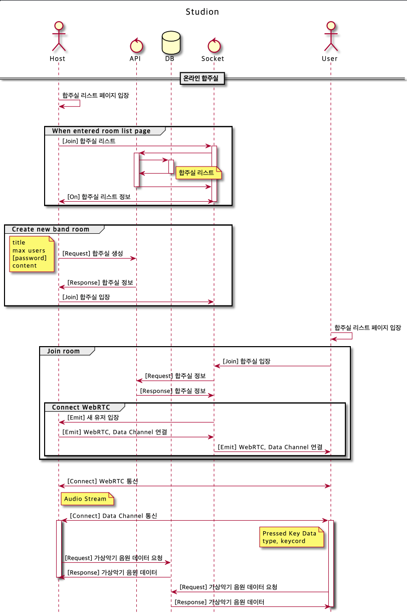
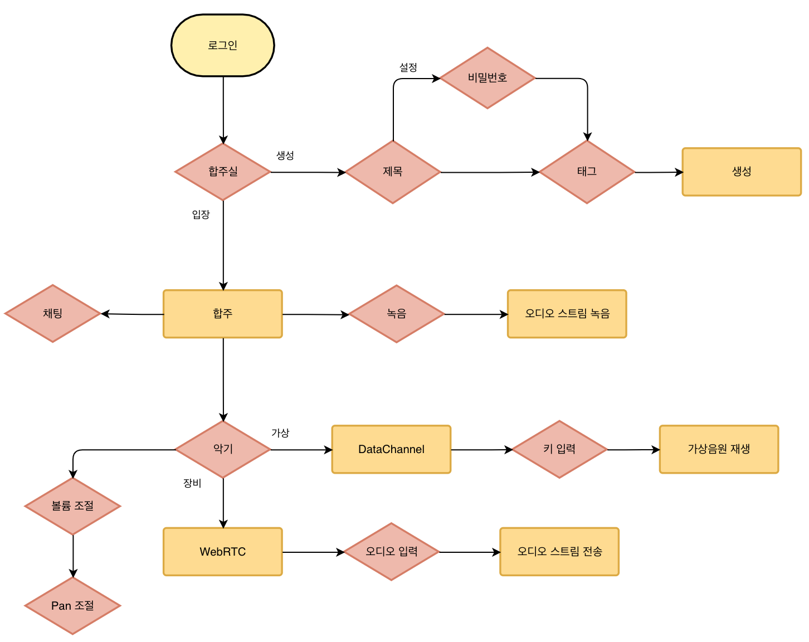
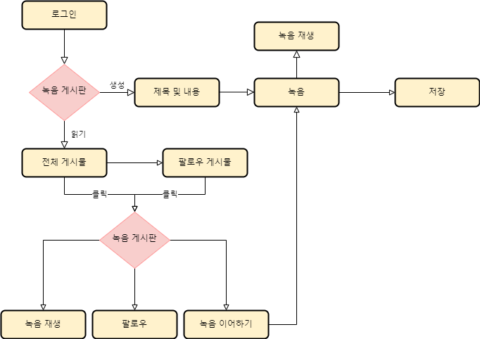
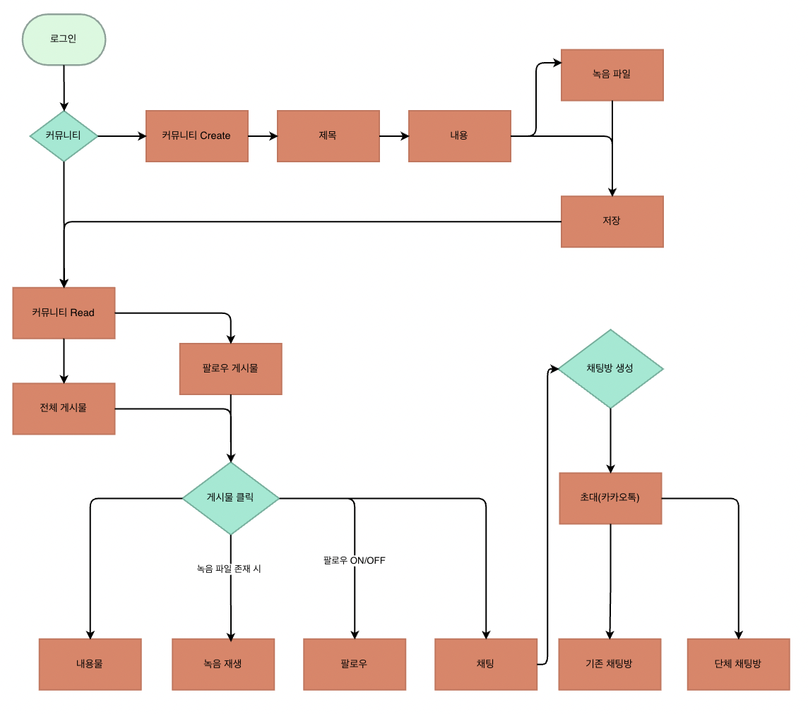
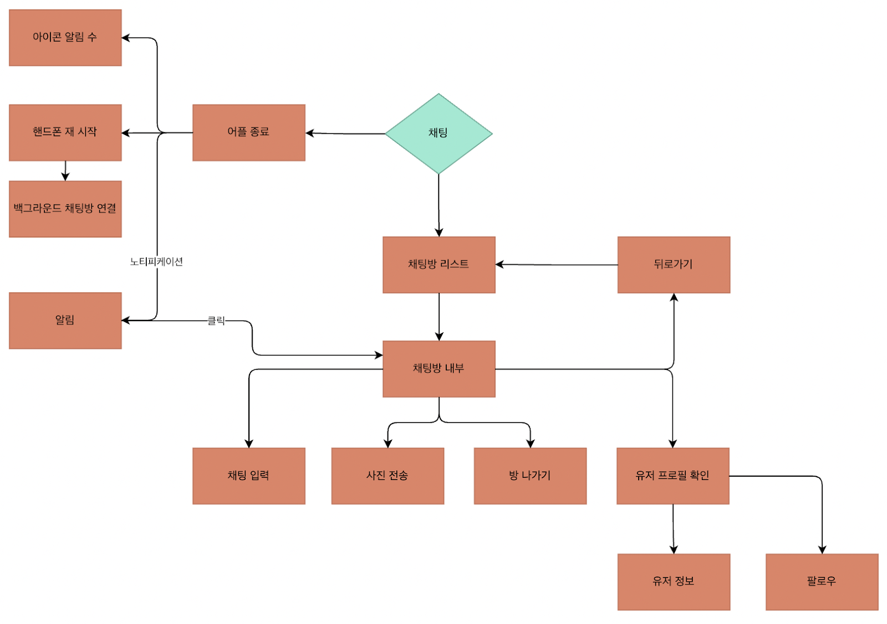
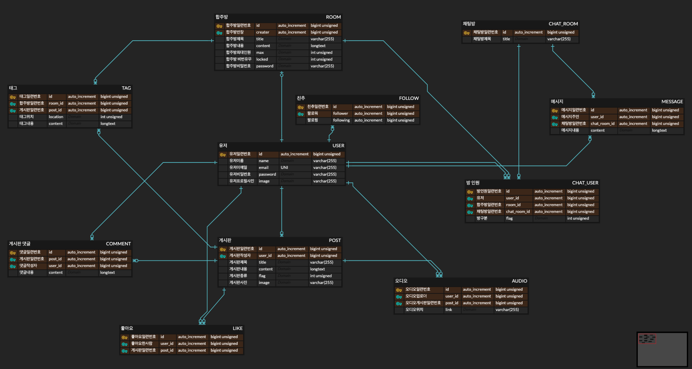

# 스타지온 온라인 밴드 서비스

# 개요

## 아이디어 요약

글로벌, 비대면 시대에 맞춘 온라인 합주 서비스

악기를 좋아하는 사람이라면 누구나 참여가능한 서비스를 제작하고자 함

## 제안 작업

전문적인 지식이나 악기가 없어도 키보드로 간단하게 참여
장비를 갖추고 있다면 보다 높은 퀄리티로 연주 할 수 있도록 구성

## 역할분담

<aside>
🖥️ 프론트엔드
- 박동현 : 팀 리더 / 온라인 합주실 / 녹음 릴레이 구현
- 김광일 : 밴드 커뮤니티 / DM 기능 구현

백엔드
- 이인준 : DB, 시스템 인프라 설계 / 유저 관리 및 전반적인 API 담당
- 조원찬 : 커뮤니티 관련 CRUD 구현

애플리케이션
- 김진홍 : IOS 상태관리 / DM 구현
- 김진호 : 커뮤니티 기능 구현

</aside>

# 사용자 스토리

## 전문적인 장비 없이 키보드로 참여하는 사용자

- 합주실에 입장하여 자신이 원하는 악기를 선택 후 정해진 키를 입력하여 연주

## 장비를 갖춘 사용자

- 합주실에 입장하여 음성 입력장치를 선택 후 연주

## UML 다이어그램

# 서비스 별 흐름

## 온라인 합주실

1. 로그인하여 합주실을 찾거나 새롭게 생성
2. 합주실 생성시 제목, 비밀번호(선택), 태그(선택) 작성
3. 합주실에 입장하면 소켓서버 및 DataChannel에 접속
4. 실제 장비를 사용한다면 WebRTC의 Peer to Peer 통신을 통해 실시간 음성 스트림 전송
5. 키보드를 이용한다면 DataChannel을 통해 실시간 키 입력 정보 전송
6. 상대방의 볼륨 및 pan을 자신에 맞게 조절
7. 음성 스트림 녹음 기능
8. 합주실 내부에서 간단한 채팅기능 제공

## 녹음 릴레이

1. 로그인 이후 게시판을 들어가 게시물을 보거나 게시물을 작성
2. 게시물 생성시 제목과 내용을 작성
3. 작성한 이후 녹음을 시작하고 녹음을 멈추고 자신이 다시 재생하여 확인
4. 모든 내용의 작성이 끝나고 녹음이 끝나면 게시물을 저장
5. 게시물을 읽을 시 전체와 팔로우 게시물로 분리
6. 원하는 게시물을 클릭하여 게시물의 내용 확인
7. 녹음 재생,  작성자 팔로우 기능
8. 이전의 녹음에 자신의 파트 녹음 이어 하기 가능
9. 녹음 이어하고 저장을 하면 게시물이 생성되고 원본 녹음 생성자 태그

## 밴드 커뮤니티

1. 로그인 후 커뮤니티 탭 클릭
2. 커뮤니티 create 버튼을 눌러 게시글 생성
3. 제목과 내용을 입력
4. 녹음 파일이 있다면 녹음 파일로 등록 후 저장
5. 만약 핸드폰인 경우 위치 저장
6. 저장 후 게시글이 있는 화면으로 이동
7. 팔로우 탭이 있음. 핸드폰의 경우 커뮤니티 탭에 ‘주위 게시물 찾기’ 탭이 있음
8. 해당 탭을 누르면 내 주위에서 작성된 게시물들만 따로 볼 수 있음
9. 팔로우 탭을 누르면, 팔로우한 사람의 게시물을 볼 수 있음
10. 해당 게시물을 클릭
11. 게시물의 내용과 녹음 파일, 채팅 보내기, 팔로우, 댓글이 있음
12. 채팅 보내기를 누를 시 socket.io 통신을 통해 채팅방이 생성 후 상대방과 채팅 할 수 있음
13. 해당 채팅방에 다른 사람들을 초대할 수 있으며, 초대할 시, 새로운 단체 채팅방이 생성(카카오톡)
14. socket.io는 백그라운드에서 작동 시켜, 어플을 사용하지 않을 때에도 채팅 알림이 발생
15. 어플 아이콘에 알림 수 표시
16. 핸드폰이 재 시작시, 자동으로 백그라운드에서 socket.io 연결해 채팅방과 계속 소통

# DataBase 및 System architecture 설계

## DataBase 설계

<aside>
📓 Laravel Migrations, Model 정의
Entity-Relation Diagram (ERD)

</aside>

## System arichitecture

# 후속 작업

- [ ]  유저의 유입을 위한 컨텐츠 기획
- [ ]  타 SNS에 공유하여 참여 유도
- [ ]  튜토리얼 등 가이드 라인 제작